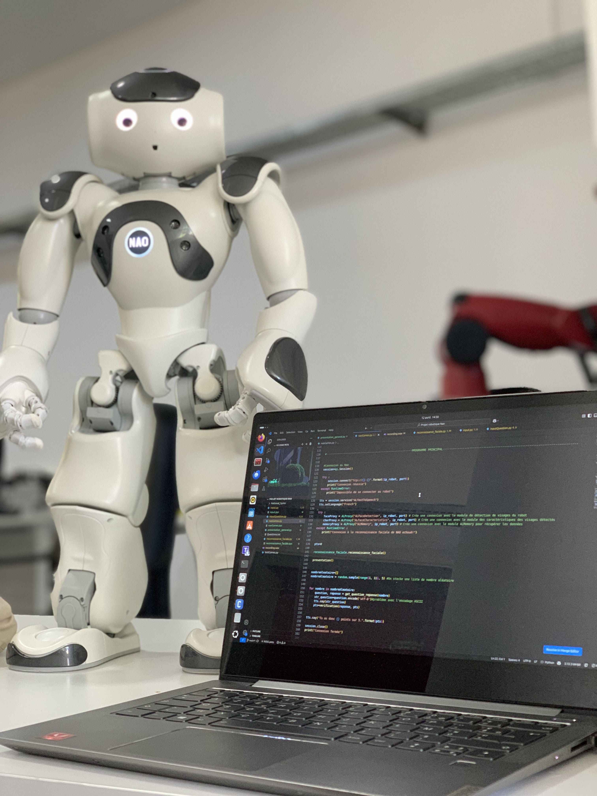

# Projet robotique Nao

Ce projet explore l'intégration des robots humanoïdes dans l'éducation à travers
la conception et l'animation d'une session interactive éducative avec le robot Nao.
L'objectif principal est de sensibiliser les enfants, âgés de 5 à 10 ans, à la
biodiversité marine de l'île Maurice tout en favorisant leur engagement et leur
curiosité via des méthodes pédagogiques innovantes. La session repose sur un jeu
interactif intitulé "Qui suis-je ?", où Nao guide les participants à travers des
devinettes éducatives et des interactions engageantes.

<p align="center">
  
</p>

## Utilisation de l'animation

Téléchargez le logiciel Choregraphe sur le lien suivant :
```bash 
https://support.old.unitedrobotics.group/en/support/solutions/articles/80001018812-nao-6-downloads
```
Suivez les étapes d'installation. Une fois terminé, ouvrez le logiciel Choregraphe.

Connectez-vous au robot et ouvrez le fichier National_Hymn.pml dans le dossier National_Hymn.

## Utilisation des scripts d'interactions

### Prérequis

1. Système d'exploitation : Ubuntu Linux (version recommandée).

2. Python : Version 2.7 (nécessaire pour Naoqi SDK).

3. Logiciels nécessaires :

   * pip pour Python 2.7

   * SDK Naoqi pour interagir avec le robot Nao

   * MySQL et XAMPP pour la gestion des bases de données
   
### Étapes d'installation

### 1. Installation de Python 2.7 et de pip

* Téléchargez et installez Python 2.7 depuis : https://www.python.org/downloads/

* Installez ensuite pip pour Python 2.7 :
```bash 
curl https://bootstrap.pypa.io/pip/2.7/get-pip.py -o get-pip.py  
python2.7 get-pip.py  
```

### 2. Installation du SDK Naoqi

* Ajoutez le chemin du SDK dans le fichier .bashrc :
```bash
echo "export PYTHONPATH=/opt/pynaoqi/lib/python2.7/site-packages:$PYTHONPATH" >> ~/.bashrc  
source ~/.bashrc  
```
### 3. Installation des Dépendances

* Utilisez pip pour installer les bibliothèques nécessaires :
```bash
pip2 install numpy==1.16.6 mysql-connector-python==2.1.7 paramiko==2.12.0 SpeechRecognition==3.9.0  
```

### 4. Configuration de la Base de Données

* Installez XAMPP pour créer un serveur local phpMyAdmin

* Importer la base de données nao_games.sql 

### 5. Exécution des Scripts

* Avant d'exécuter les scripts, Assurez-vous que le robot Nao est connecté au même réseau Wi-Fi que votre machine

* Vérifiez aussi l'adresse IP du Nao pour pouvoir assuré la connectivité entre la machine et le robot

* Lance les scripts Python depuis le terminal :
```bash 
python2.7 nao_games.py  
```
## Auteur
- **Math-Baba** - [GitHub](https://github.com/Math-Baba)

